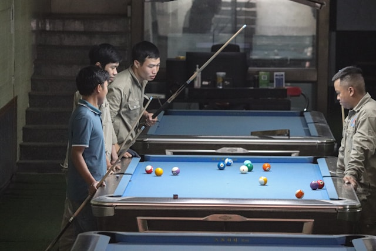

#### The Rules of My Game

<figure>

<figcaption aria-hidden="true">Photo by <a href="https://unsplash.com/@nathan_cima?utm_content=creditCopyText&utm_medium=referral&utm_source=unsplash">Nathan Cima</a> on <a href="https://unsplash.com/photos/a-group-of-men-standing-around-a-pool-table-CiVuPxerdAA?utm_content=creditCopyText&utm_medium=referral&utm_source=unsplash">Unsplash</a></figcaption>
</figure>

## Introduction

We read The Three Musketeers, and also saw a brief video from Squid Game. Let us further contemplate the actions of the characters.

### Discussion-1: Structure

The Game consists of:

- Rational *Players*
- Numerical *Payoffs*
- Arranged in a Game *Payoff Matrix*
- Player *Strategies* to navigate the Matrix

What strategies are possible as a bowler in Cricket? As a batsman? What strategies are **permitted**? By whom?

## The Game of Trust

So, let us **play** a Game, on the <u>[**Game of Trust Website**](https://ncase.me/trust)</u> ! Please pair up on one laptop to play this.

### Discussion-2: Nature

- **Strategies** in PD define what actions you will take in response to actions others might take.
- We saw quite a few strategies here
- The *best strategy* is one that **survives**!
- ***Survival is everything***. That is what D’Artagnan and the Three Musketeers were also basing their actions on!
  - Read more about this idea in this (possibly illegal) copy of <u>[**Nassim Nicholas Taleb’s Book, “Skin in the Game”**.](https://philosophiatopics.files.wordpress.com/2018/10/skin-in-the-game-nassim-nicholas-taleb.pdf)</u>
  - Or you can <u>[**watch Taleb speak**](https://youtu.be/uv6KLbkvua8?feature=shared)</u>
- We will encounter *Survival* again soon!

## Reading: Robert Axelrod’s Study on Cooperation

This is a famous study of the Iterated Prisoners’ Dilemma by Robert Axelrod, <u>[**The Evolution of Cooperation** (PDF)](Axelrod-Hamilton.pdf)</u>. We will read just a wee bit of it in class.

And here is Robert Axelrod on the **RadioLab Podcast**:

<iframe frameborder="0" scrolling="no" height="130" width="100%" src="https://www.wnyc.org/widgets/ondemand_player/wnycstudios/#file=/audio/json/104010/&amp;share=1">
</iframe>

Spotify:

<iframe style="border-radius:12px" src="https://open.spotify.com/embed/episode/1pFEPQUVNgTkRa13y4Gilk?utm_source=generator" width="100%" height="352" frameBorder="0" allowfullscreen allow="autoplay; clipboard-write; encrypted-media; fullscreen;
picture-in-picture" loading="lazy">
</iframe>
</iframe>

 
Transcript: <u><https://www.wnycstudios.org/podcasts/radiolab/segments/104010-one-good-deed-deserves-another></u>

### Nash Equilibrium and Dominant Strategy in PD

Are there COSTs to ACTIONs? Who decides?

How does one ACT to minimize costs and maximize rewards? Remember, we are all **Agents**, with our own vocabulary of **Actions** which we might use **Again** and again, and experience an **Aggregate** outcome in society.

The **Payoff Matrix** in PD is:

<table class="gt_table" data-quarto-disable-processing="false" data-quarto-bootstrap="false">
  <thead>
    <tr class="gt_heading">
      <td colspan="3" class="gt_heading gt_title gt_font_normal gt_bottom_border" style><strong>Prisoners’ Dilemma Payoff Matrix</strong></td>
    </tr>
    &#10;    <tr class="gt_col_headings gt_spanner_row">
      <th class="gt_col_heading gt_columns_bottom_border gt_center" rowspan="2" colspan="1" style="text-align: center; font-weight: bold;" scope="col" id="Player #2">Player #2</th>
      <th class="gt_center gt_columns_top_border gt_column_spanner_outer" rowspan="1" colspan="2" scope="colgroup" id="&lt;span class='gt_from_md'&gt;&lt;strong&gt;Player #1&lt;/strong&gt;&lt;/span&gt;">
        <strong>Player #1</strong>
      </th>
    </tr>
    <tr class="gt_col_headings">
      <th class="gt_col_heading gt_columns_bottom_border gt_center" rowspan="1" colspan="1" style="text-align: center; font-weight: bold;" scope="col" id="C">C</th>
      <th class="gt_col_heading gt_columns_bottom_border gt_center" rowspan="1" colspan="1" style="text-align: center; font-weight: bold;" scope="col" id="D">D</th>
    </tr>
  </thead>
  <tbody class="gt_table_body">
    <tr><td headers="Player #2" class="gt_row gt_center" style="font-weight: bold;">C</td>
<td headers="C" class="gt_row gt_center">(R=3, R=3)</td>
<td headers="D" class="gt_row gt_center">(T=5, S=0)</td></tr>
    <tr><td headers="Player #2" class="gt_row gt_center" style="font-weight: bold;">D</td>
<td headers="C" class="gt_row gt_center">(S=0, T=5)</td>
<td headers="D" class="gt_row gt_center" style="background-color: #BEBEBE;">(P=1, P=1)</td></tr>
  </tbody>
  &#10;  <tfoot class="gt_footnotes">
    <tr>
      <td class="gt_footnote" colspan="3"> <strong>Payoffs are (Player#1, Player#2)</strong></td>
    </tr>
    <tr>
      <td class="gt_footnote" colspan="3"> R = Reward; S = Sucker’s Payoff; T = Temptation; P = Punishment</td>
    </tr>
    <tr>
      <td class="gt_footnote" colspan="3"> Shaded Cells are Nash Equilibria</td>
    </tr>
  </tfoot>
</table>

Note that, in order for this to be a true Prisoners’ Dilemma, we need:

$$
Temptation > Reward > Punishment > Sucker's~ Payoff\\\
$$
$$
R > (S + T)/2
$$
The first condition ensures that Temptation (to D) is always stronger than the Reward(for C); and the second ensures that the two Players cannot mutually agree to alternate between C and D and have a higher net reward !! <u>[Can you Game Game-Theory ? That’s a Cabal !!](https://www.quora.com/Who-is-responsible-for-repairing-roads-if-they-are-damaged-by-heavy-vehicles-Who-can-we-complain-to-if-our-roads-are-damaged)</u>

Wherever you “are” on the matrix, you can **always** improve your situation by defecting!! “D” is your **best move**, your **“Dominant Strategy”**, because that is how the matrix is (numerically) stacked. And if both players do that, then we end up at the bottom-right cell, which says “(D,D)”, where the game stays forever, in state called the **“Nash Equilibrium”**.  

While just a little thought, even hesitation, could have led us “(C, C)”…An altruistic decision to “C” first could tip the scales in favour of “(C,C)”.

Sigh.

## SouthWest Airlines: A Case Study

OK, so how does PD show up in a real-world context? Here is a business story: The story of Southwest Airlines’ <u>[**Early Bird Check-In**.](https://mindyourdecisions.com/blog/2013/03/05/southwest-airlines-boarding-and-game-theory/)</u>

What could be the passengers’ strategy?

## Hotelling’s Phenomenon: A Case Study

Why are Hotels and Petrol Pumps located next to each other? Here is the <u>[**Hotelling’s Phenomenon**, explained.](https://mindyourdecisions.com/blog/2008/03/25/game-theory-tuesdays-hotelling%e2%80%99s-game-or-why-gas-stations-have-competitors-nearby/)</u>



## What are the Assumptions in **Prisoners’ Dilemma**?

- That gains and pains can be **quantified**
- Rationality
- Players have identical and opposed aims i.e. **Adverserial Symmetry**.
- In most cases, the game is **zero-sum**
- Some form of spoke/unspoken agreement as to what may and may not be done ( i.e Rules of the Game )

## <u>[Wait, But Why?](https://waitbutwhy.com)</u>

- So, the PD matrix is loaded towards “D”. ;-(
- “Defect” is the **Dominant Strategy**
- Societal Outcomes will then be ….horrible. This is the **Nash Equilibrium** in PD.
- OK, so public behaviour can be influenced by individual decisions to **first C, and then respond**?
- But is it always **zero sum**? Can it be non-adverserial?
- Are there other Strategies? Other Games even?

We’ll see.

## Fun Stuff With Game Theory

1.  Olivia Jack , Dirk Brockmann. “*The Prisoner’s Kaleidoscope*”: The prisoner’s dilemma game on a lattice Pattern Formation, Beauty and Chaos in a Game Theoretic Model. <u><https://www.complexity-explorables.org/explorables/prisoners-kaleidoscope/></u>

## References

1.  Jeff Desjardins (2014). *The Silver Rule, Taleb, and the Slippery Slope to Interventionism*. <u><https://medium.com/@jeffdesjardins/the-silver-rule-taleb-and-the-slippery-slope-to-interventionism-ef6baef17c23></u>

2.  Carl Sagan’s “A New Way To Think About Rules To Live By”. <u><https://tetrahedral.blogspot.com/2011/12/carl-sagans-new-way-to-think-about.html></u>

3.  Here is a good Summary of modern thinking about Human Cooperation: *The Evolution of Human Cooperation*, <u>[**PDF**](The%20Evolution%20of%20Human%20Cooperation%20–%20The%20Evolution%20Institute.pdf)</u>

4.  John D. Williams, *The Compleat Strategyst: Being a Primer on the Theory of Games of Strategy*, RAND Corporation, <ISBN:9780833042224>. This is a very humourous and fun book on Game Theory ! It is available for free online at the <u>[**RAND Corporation Website.**](https://www.rand.org/content/dam/rand/pubs/commercial_books/2007/RAND_CB113-1.pdf)</u>

5.  Ken Binmore,*Playing for Real: A Text on Game Theory*, <ISBN:9780195300574>, Oxford University Press, March 2007. <u>[Available here.](https://djvu.online/file/yFqEW5Mqk0aVd)</u>

6.  Avinash Dixit, Susan Skeath, David Reiley, *Games of strategy*, ISBN: 9780393124446, New York :W.W. Norton & Company, 2015.

7.  Brams Steven J., 1994. “Game Theory and Literature,” Games and Economic Behavior, Elsevier, vol. 6(1), pages 32-54, January. <u>[Available here.](http://www.sscnet.ucla.edu/polisci/faculty/chwe/austen/brams1994.pdf)</u>

8.  Alexander Mehlmann,*The game’s afoot! Game theory in myth and paradox*, American Mathematical Society 2000. <u>[AMS Bookstore](https://bookstore.ams.org/stml-5/)</u>

9.  *The Tragedy of the Commons*. <u><https://en.wikipedia.org/wiki/Tragedy_of_the_commons></u>

## Game Theory Pop Music, Movie Clip, and TV ad Playlist !!

1.  The Alan Parsons Project: Eye in the Sky. <u><https://youtu.be/fRMf3wKBCPo></u>

2.  Chris de Burgh: Don’t Pay the Ferryman!
    <u><https://www.youtube.com/watch?v=Q-a5TAL-IXs></u>

3.  Abba: The Name of the Game
    <u><https://www.youtube.com/watch?v=T5Qf_7HM1cM></u>

4.  Bachchan vs Warsi: Want a Pepsi - Tit for Tat
    <u><https://www.youtube.com/watch?v=gc6QZcxbMZE></u>

5.  The Princess Bride - Battle of Wits - Which Strategy to Use here?
    (Asymmetric Information)
    <u><https://www.youtube.com/watch?v=rMz7JBRbmNo></u>

6.  The Gods Must be Crazy (Brinkmanship)
    <u><https://www.youtube.com/watch?v=9LvViKftRnA></u>

7.  L.A. Confidential
    <u><https://criticalcommons.org/embed?m=pBXsAUvh9></u>

## Activity-2

Take a walk in the nearest urban area this weekend. Unobtrusively, observe what people are doing. Note these down when they seem to be visible examples of “Cooperate” or “Defect”. For or Against whom?

No pictures.
