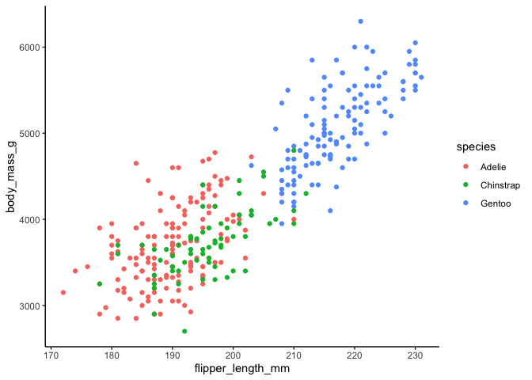

## Introduction

Quarto enables you to weave together content and executable code into a
finished document. To learn more about Quarto see <https://quarto.org>.

I am trying to replicate this [Quarto in Hugo
Workflow](https://quarto.org/docs/output-formats/hugo.html) at
<https://quarto.org/docs/output-formats/hugo.html>.

    library(tidyverse)
    library(mosaic)
    library(ggformula)
    library(palmerpenguins)

## Running Code

When you click the **Render** button a document will be generated that
includes both content and the output of embedded code. You can embed
code like this:

    penguins %>% 
      gf_point(body_mass_g ~ flipper_length_mm, colour = ~ species) %>% 
      gf_theme(theme = theme_classic())

    ## Warning: Removed 2 rows containing missing values or values outside the scale range
    ## (`geom_point()`).

You can add options to executable code like this

    ## [1] 4

The `echo: false` option disables the printing of code (only output is
displayed).
